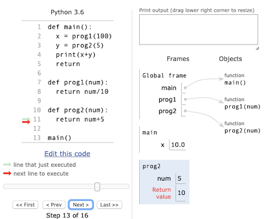

We use [repl.it](https://repl.it/) Teams for assignments in this course.  Every lab or assignment has the following things:
* A `Markdown.md` file which provides instructions. Click the "Preview" toggle in the upper-right of the text file for nicely-formatted instructions.
* One or more files ending in `.py`, including a `main.py` file. You can write multiple lines of code and evaluate them all using the run button.
* The Python console on the right-hand pane, which takes user input and evaluates each line as you enter it.  The Python console has a prompt that begins with `>`.  

### PythonTutor

If you are writing code and can't quite figure out why Python is doing something _other_ than what you think it should, [PythonTutor](http://pythontutor.com/) is an **excellent** resource.  It allows you to run your code step-by-step, observing what is stored in memory and what is printed to the console.  


## Week 1

### Expressions and Assignments

The Python interpreter can be used like a "Calculator" on your laptop.  When you click the equals sign on your calculator, nothing happens.  This is the same thing as hitting Enter in the Python interpreter.  

An **expression** is an input that Python evaluates and returns as output.  Expressions follow the order of operations you learned in grade school; parentheses can change this order.  When you evaluate expressions in the Python interpreter, the output is spit out to the screen.  When you evaluate expressions in the text editor, you need to tell the program to print the output to the screen with `print()`.

```
4
4+2
4-2
4*2
4/2
4*4+2
4*(4+2)
4**2
4**3
```

An **assignment** is an input that Python evaluates and stores in memory.  An assignment always has three parts: a variable name, an equals sign, and an expression.  

```
A1 = 5
X = A1 + 1
Y = X
newVar = X + Y
```

### Numerical Data Types

There are two types of numbers we will work with:
* An **integer** (`int`) is a data type that represents a number with no fractional component (a whole number).
* A **floating point real value** (`float`) is a data type that represents a number with fractional values. 

You can check the type of a values with the `type()` function:

```
type(4)
type(4.0)
type(4.000)
type(4.300)
```

This may seem unintuitive - isn't 4 the same as 4.0?  This difference is a result of how Python stores these data types in memory, and beyond the scope of this class.  

### The String Data Type

A **string** (`str`) is a data type that represents a sequence of characters (text).  Like numbers, strings are just another type of data.  Strings are surrounded by quotes, which can be single (e.g., `'hi'`) or double (e.g., `"hi"`).  They can be used in expressions or assignments.

```
'a'
'ab'
stringVar='!'
```

The `+` operator **concatenates strings**.

```
'a'+'b'
'b'+'a'
```

### The List Data Type

A **list** is an ordered collection of items.  Lists are written as comma-separated expressions surrounded by square brackets. The expressions within a list can be of different types.

```
[5,10,15]
myList = [5,10,15]
stringList = ['hi','there','class']
mixedList = [1,'2','three',4]
```

Each element of a list is assigned a number - its position or **index**. To retrieve the `i`th element of a list (such as a list stored in the `myList` variable), use the expression

```
myList[i]
```

where `i` is an integer.  Watch out: **the index starts at 0!** That is, the first element of `myList` is specified by `myList[0]`.

### Expression Input and Output Types

As a general rule, inputs and outputs of expressions have the same type (e.g. numeric, string, or list). For example, the expression 1+2 outputs a number, while the expression '1'+'2' outputs a string.  In Python3, expressions that involve a `float` and an `int` will output a `float`.

## Week 2

### Built-in Functions

A **function** is an executable block of code.  Each function has a name followed by parentheses which may contain zero or more inputs, or **arguments**.  Functions may return values as well.  

| Description  | Name | Num of Arguments | Returns | Examples |
| --- | --- | --- | --- | --- |
| Get the type of an object  | `type()`  | one | the object's type | `type(1.0)` <br> `type('a string')` |
| Print the arguments to the screen | `print()`  | zero or more | nothing | `print()` <br> `print(145.99)` <br> `print('a',1,'b')` |
| Get the length of a list | `len()` | one `list` or `str` | an `int` | `len([1,2,3,4,5])` | 
| Get a range of integers | `range()` | one `int` | a `range` object from 0 up to _but not including_ the argument | `range(10)` <br> `range(5)` |
| Convert to a list | `list()` | one | a `list` of the argument | `list(range(5))` |
| Convert to a string | `str()` | one | a `str` of the argument | `str(5)` <br> `str([1,2])` |
| Convert to a float | `int()` | one numeric or `str` | a `float` of the argument | `float('5.0')` <br> `float(5)` |
| Convert to an integer | `int()` | one numeric or `str`| an `int` of the argument | `int(5.0)` <br> `int('5')` |

### For Loops

A **for loop** specifies repeated execution. It allows us to say "for each element in a list, do something."  For loops have a special syntax:

```
for item in [0,1,2,3]:
  print(item)
```

Let's break down the previous two lines:
- The `for`, `in`, and the colon (`:`) are part of every for loop.
- There is a list (`[0,1,2,3]`) and a variable name (`item`) that we specified - the list can be any list, and the variable name can be any variable name.  
- The **indentation** in the second line matters -- all lines that are indented under the `for` statement are executed at each iteration.  In this case, we will print the value assigned to the `item` variable.

For loops work by assigning the variable name (`item`, in this case) to **each element** of the list and executing the lines of code that are indented under the for loop.  The for loop above will print

```
0
1
2
3
```

which is exactly the same as if we wrote out each line of the for loop:

```
item = 0
print(item)
item = 1
print(item)
item = 2 
print(item)
item = 3
print(item)
```

For loops can execute multiple lines of code at each iteration, and can iterate over lists containing different elements. For example

```
myList = [1,'hey','there']
for loop_var in myList:
  print(loop_var)
  print(loop_var,'again')
```

will print

```
1
1 again
hey
hey again
there
there again
```

## Week 3

### User-Defined Functions

Like built-in functions, user-defined functions have a name followed by parentheses which may contain zero or more inputs, or **arguments**.  Built-in functions may return values as well.  Defining functions in your code has a special syntax:

```
def sing():
  print(‘Happy birthday to you,’)
  print(‘Happy birthday to you,’)
  print(‘Happy birthday dear Frito,’)
  print(‘Happy birthday to you!’)
  return
```
Let's break this function down:
- The function above is named `sing`, takes zero inputs, and returns nothing.  
- The `def` and colon (`:`) are part of every function definition.
- The **indentation** of the subsequent lines matter -- all lines that are indented under the `def` line will be executed when the function is called.
- The `return` statement at the end denotes that the function is over and, if anything is specified, it will be returned. In this case, the `sing` function returns nothing.

If we enter this in the text editor and hit Run, nothing would be printed! That's because, while we have **defined** our function, we haven't yet **called** it.  That is, we need to explicitly evaluate it:

```
sing()
```

This must happen _after_ the function is defined.

### Variable Scope

Consider the following code snippet:

```
def main():
  x = prog1(100)
  y = prog2(5)
  print(x+y)
  return

def prog1(num):
  return num/10

def prog2(num):
  return num+5
  
main()
```
The `prog1` and `prog2` functions take inputs, or **arguments**.  In these function definitions, the variable name (e.g. `num`) is a **formal parameter** that is assigned the value of the input when the function is called. 

The **scope** of a variable is the part of the program where it may be referenced.  Formal parameters (in the function defintions) and other variables assigned within a function only be used within that function.  Functions can communicate information back to the place where it is called by returning values.  Let's walk through the code above as an example.  The first thing Python will do is store these function definitons in memory, skipping over all the contents. 

<p align="center">
  
</p>

By the time we are at Line 13 (red arrow), Python has stored three functions in memory (`main`, `prog1`, and `prog2`). Further, Python knows that there is one formal parameter for `prog1` and one formal parameter for `prog2`.  Here, they both happen to be called `num`.  

The next step will call the `main` function, which in turn calls `prog1` with `100` as the input value (Line 2).

<p align="center">
  
</p>

When we are within the `prog1` function, note that a **new** memory table has been created to store the variables that are defined within this function.  The `prog1` function assigns the input to the formal parameter, and will return a float.  This value will be store in the `main` function as the variable `x` (Line 2), and will move on to calling `prog2`.

<p align="center">
  
</p>

We are now about to return the value from `prog2`. Note that there are three tables now: a **global table**, which contains the function names, a `main` table, and a `prog2` table.  We can only refer to variables within the `prog2` table if we are within the `prog2` function.

<p align="center">
  
</p>

At the end of the `main` function, there are two variables within the function (we call these **local variables** to differentiate them from the variables and functions in the global frame).  These variables, `x` and `y`, are the only integers that we can refer to within `main`.  

### The Boolean Data Type and Boolean Expressions

A **boolean** is a data type that can only be one of two values: `True` or `False`.  Booleans can appear as outputs or inputs of some expressions (including some new operators).

| Operator  | Symbol | Input Types | Return Types | Examples |
| --- | --- | --- | --- | --- |
Equality | `==` | numeric or `str` | `boolean` | `1==2` <br> `'a'=='a'` |
Inequality | `!=` | numeric or `str` | `boolean` | `1!=2` <br> `'a'!='a'` | 
Less Than  | `<` | numeric | `boolean` | `1<2`<br> `2.0<1.5` |
Less Than<br>or Equal To | `<=`  | numeric | `boolean` | `1<=1`<br> `2.0<=1.5` |
Greater Than | `>`  | numeric | `boolean` | `1>2`<br> `2.0>1.5` |
Greater Than<br>or Equal To | `>=`  | numeric | `boolean` | `1>=1`<br> `2.0>=1.5` |
And | `and` | `boolean` | `boolean` | `True and False`<br>`4>5 and 6>=6` |
Or | `or` | `boolean` | `boolean` | `True or False`<br>`4>=5 or 6>=6` |
Not | `not` | `boolean` | `boolean` | `not True`<br>`not 4<5` |
In | `in` | mixed types | `boolean` | `'a' in ['a','b','c']`<br>`1 in [0,'a',2]` |

### Conditional Statements

An **IF** statement specifies a block of code only if some condition (e.g. a Boolean expression) is `True`.  It allows us to say "if some value is `True`, do somthing."  IF statements have a special syntax:

```
x = 4
y = 10
if x < y:
   print('x is less than y')
```
Let's break down the previous lines:
- The first two lines assign integers to variables `x` and `y`.
- The `if` and the colon (`:`) are part of every IF statement. 
- There is a Boolean expression (`x < y`), which will evaluate to `True` or `False`.  
 - If the expression evaluates to `True`, then the indented line will be executed.
 - If the expression evaluates to `False`, then the indented line will _not_ be executed.
- Here, the Boolean expression evaluates to `True`, so the string is printed to the scren.  
- Again, the **indentation** in the lines underneath the IF statement matters.

There are variants of this IF statement that allows us to say "if some value is `True`, do something. Otherwise, do something else."  This is called an IF/ELSE statement:

```
x = 4
y = 10
if x < y:
   print('x is less than y')
else:
   print('x is greater than y')
```

Here, only one of the two print statements will be executed, depending on whether the Boolean expression evaluates to `True` or `False` (and enters the `else` block of code).  

Finally, there is an ELIF statement, which allows us to say "if some value is `True`, do something. Otherwise...if some _other_ value is `True`, do something. Otherwise...if some _other_ value is `True`, do something.

```
x = 4
y = 10
if x < y:
   print('x is less than y')
elif x == y:
   print('x and y are equal')
else:
   print('x is greater than y')
```

Note that, while there are now three different print statements, only **one** will ever be printed because only one of the IF/ELIF/ELSE conditions can evaluate to `True`.

## Week 7

### Working with Tables

When we began to work with motifs, we represented them as a **list of strings**.  It is often useful to consider them as a table, where each string is a row and we can retrieve a character from a certain column.  This allows us to do things like count the number of `A/C/G/T` in a column to build a counts table or a frequency table. 

<p align="center">
  
</p>

You can use this "double indexing" for a **lists of lists** as well: the variable below represents a table with four rows and three columns.

```
ListOfLists = [[1,2,3],[2,3,4],[4,5,6],[5,6,7]]
```

To iterate over the _rows_, you can use the following simple FOR loop:

```
for i in range(len(ListOfLists)):
  for j in range(len(ListOfLists[i])):
    print(ListOfLists[i][j])
```

<p align="center">
  
</p>

How can we iterate over the _columns_ first?  To do this, we need to assume that *the length of every row is the same* (since we're working with tables, we can make this assumption).  Then, we simply need to swap the two FOR loops, using the first row to determine the number of columns:

```
for j in range(len(ListOfLists[0])):
  for i in range(len(ListOfLists)):
    print(ListOfLists[i][j])
```

<p align="center">
  
</p>

Remember to **always** index into the variable with rows (`i`) and then columns (`j`).

## Week 9

### Files in Python

For many homeworks, the `helper_functions.py` have included a function to read strings from a text file.  In HW 6.5, you will read text from a file _and_ write text to a file.  This may be very useful for final projects. 

When you read a book, you need to **open** the book, **read** the text, and **close** the book.  Reading files in Python follows the same structure.  First, a `File` is a new type (like `int`, `str`, `list`...), but has some built-in functions that are designed to work _only_ with `File` variables.  
- Filenames are represented as strings (e.g. `myfile.txt`)
- You can open a file for **reading** (`r`, default) or **writing** (`w`).  If you're opening a file for reading, the file must already exist.  You can read the contents of the file as a single string (`read()`) or as a list of strings, one for each line (`readlines()`).  These functions have a **special syntax**: they require a `File` object. 
- When you are done with either reading or writing, **close** the file with the `close()` function (which also has a special syntax).

| Description  | Name | Num of Arguments | Returns | Examples |
| --- | --- | --- | --- | --- |
| Open a `File`  | `open()`  | two `str` | `File` | `open('myfile.txt','r')` <br> `open('myfile.txt','w')` |
| Read contents | `read()`  | zero | `str` | `myFile.read()` |
| Read contents <br> as lines | `readlines()` | zero | a `list` of strings | `myFile.readlines()`  | 
| Write to a `File` | `write()` | one `str` | nothing | `myFile.write('Hi\n')` | 
| Close a `File` | `close()` | zero | nothing | `myFile.close()` |

Here is an example:

```
fname = 'mysteryFile.txt'
myFile = open(fname,'r') # open for reading
text = myFile.read() # save entire file in text variable
myFile.close() # close the file
print(text) # print the text
```

### Manipulating Strings

When you read in a file, you may want to process the strings in some way.  Luckily, there are functions to easily strip whitespace and split a string into multiple parts.  Strings are types that also have this **special syntax** where functions can be called directly on them.
- To remove any whitespace (including newlines, spaces, and tabs), use the `strip()` function.
- To split a string into multiple parts, use the `split()` function. The `split()` function requires a **delimiter** - a string that will be used to split the string on.  With no arguments, `split()` will use whitespace as a delimiter.  However, you can pass in _any_ string as a delimiter. 
- Conversely, you can take a list of strings and concatenate them with a delimiter using the `join()` function. 
- YOu can also replace some text in a string (a _substring_) with another substring with the `replace()` function. The function takes two arguments, and all instances of the first argument are replaced by the second argument.
- Finally, you can also convert all letters to upper-case with `upper()` and all letters to lower-case with `lower()`.  


| Description  | Name | Num of Arguments | Returns | Examples |
| --- | --- | --- | --- | --- |
| Remove <br> whitespace | `strip()`  | zero | `str` | `' abcd   '.strip()` <br> `'abcd\n'.strip()` <br> `myStr.strip()` |
| Split a string on whitespace | `split()`  | zero | `list` of strings | `'my string'.split()` |
| Split a string using <br> a delimiter | `split()` | one `str` | `list` of strings | `'bacad'.split('a')` <br> `myStr.split('-')` <br> `'a\nb\nc\nd\n'.split('\n')` |
| Concatenate a list | `join()` | zero | `str` | `['a','b','c'].join()`  | 
| Concatenate a list <br> using a delimiter | `join()` | one `str` | `str` | `['b','c','d'].join('a')`  | 
| Replace text in a string | `replace()` | two `str` | `str` | `'new*str'.replace('*',' ')`  | 
| Convert letters to uppercase | `upper()` | zero | `str` | `'abc'.upper()` |
| Convert letters to lowercase | `lower()` | zero | `str` | `'ABC'.lower()` |

### Dictionaries

Suppose we have a string from a file and we want to count the number of times each word appears:

```
myStr = 'that sam I am that sam I am I do not like that sam I am'
myList = myStr.split()
```

Using what we've learned about so far, it would be straightforward to count the number of times the word `that` appears, but what about counting _all_ occurrences of _all_ words?  

Luckily there's a new type called a **dictionary** that will allow us to complete this task.  A dictionary stores key-value pairs, where the values can be quickly retrieved by keys.
- Keys can be `str`, `int`, `float`, or a mix of types (e.g. some keys can be `str` and others can be `int`)
- Values can be `str`, `int`, `float`, `list`, `Boolean`, `File` (almost anything)

A dictionary is specified by curly braces `{}`. Like initializing an empty list with `[]` you can initialize an empty dictionary:

```
freq = {}
```

You can then add key-value pairs to this dictionary like so:

```
freq['that'] = 3
freq['sam'] = 3
freq['like'] = 1
```

In this example, the keys are `str` and the values are `int`. You can retrieve a value using the key (this will be an **expression**):

```
freq['like']
sam_val = freq['sam']  # assign the value of 'sam' to sam_val
```

You can also assign a new value to a key:

```
freq['sam'] = 100
freq['that'] = freq['that'] + 1
```

Dictionaries also provide some built-in functions to get an iterator of the keys or the values for a dictionary.  You need to explicitly tell Python that these are lists if you want to work with them.

```
for key in freq.keys():
  print(key)

key_list = list(freq.keys())
value_list = list(freq.values())
```

Note if you have the key you can always retrieve the value using `freq[key]`.  

| Description  | Name | Num of Arguments | Returns | Examples |
| --- | --- | --- | --- | --- |
| Get the keys in a dictionary | `keys()`  | zero | `PyListObject` (use `list()` <br> to convert to a list) | `freq.keys()` |
| Get the values in a dictionary | `values()`  | zero | `PyListObject` (use `list()` <br> to convert to a list) | `freq.values()` |

## Weeks 9-10

### Graphs

A graph represents a set of **objects** and **pairwise connections** between them. In the example below, there are five objects (called **nodes**, here labled a,b,c,d,e) and six directed connections (called **directed edges**).  

<p align="center">
  
</p>

Graphs are mathematical objects, and there are many relationships that can be captured by graphs. For example, in a Twitter network, the nodes may be people and directed edges may indicate who follows whom (image from a [nice introduction to graph theory](https://medium.com/basecs/a-gentle-introduction-to-graph-theory-77969829ead8)).  In this example, the post's author Vaidehi follows Beyonc\`{e} but Beyonc\`{e} doesn't follow her back.


In this class, we will describe a graph as a list of nodes and a list of edges.  

1. The list of nodes will be a list of strings.   In the example above, the node list is
```
['a','b','c','d','e']
```

2. Each directed edge will be a list with **two** strings (e.g., `['a','b']` denotes that an edge starts at `a` and ends at `b`).  The list of edges will be a list of these two-element lists (so it's a **list of lists**).  In the example above, the edge list is
```
[['a','b'],['c','e'],['b','d'],['a','d'],['c','b'],['e','d']]
```

### NetworkX

We have already seen [built-in functions](#built-in-functions) such as `type()` and `print()`, and we've seen how to work with functions imported from another file (e.g. `helper_functions.py`).  The Python community has developed substantial modules that we can use, allowing us to work with new objects and call functions that they have written.  The [`networkx`](https://networkx.github.io/documentation/stable/index.html) module is a Python library for working with graphs. 

### NetworkX: Creating a Graph

The following import statement imports this module and nicknames it `nx` so we can refer to it that way:

```
import networkx as nx
```

The lab and homework assignmentswill walk through how to make a graph and add nodes and edges. For more information beyond this crashcourse [see this tutorial for undirected graphs](https://networkx.github.io/documentation/stable/tutorial.html) (which uses `nx.Graph()` instead of `nx.DiGraph()` or `nx.MultiDiGraph()`).

Suppose we have a `nodes` variable and an `edges` variable as described above.  We can create a `networkx` graph with the following code:
```
G = nx.DiGraph()
G.add_nodes_from(nodes)
G.add_edges_from(edges)
```
The variable `G` represents a `networkx` object.  There are a number of functions that work directly on these graphs - see the [MultiDiGraph Methods List](https://networkx.github.io/documentation/stable/reference/classes/multidigraph.html) for all possibilities.

| Function Name  | Description (click for more information) |
| --- | --- |
| `G.add_node(n)` | [Add node `n` to `G`](https://networkx.github.io/documentation/stable/reference/classes/generated/networkx.MultiDiGraph.add_node.html#networkx.MultiDiGraph.add_node) |
| `G.has_node(n)` | [Checks if `n` is in `G`](https://networkx.github.io/documentation/stable/reference/classes/generated/networkx.MultiDiGraph.has_node.html#networkx.MultiDiGraph.has_node) | 
| `G.number_of_nodes()` | [Returns the number of nodes in `G`](https://networkx.github.io/documentation/stable/reference/classes/generated/networkx.MultiDiGraph.number_of_nodes.html#networkx.MultiDiGraph.number_of_nodes) |
| `G.add_edge(u,v)` | [Add edge `[u,v]` to `G`](https://networkx.github.io/documentation/stable/reference/classes/generated/networkx.MultiDiGraph.add_edge.html#networkx.MultiDiGraph.add_edge) | 
| `G.has_edge(u,v)` | [Checks if `[u,v]` is in `G`](https://networkx.github.io/documentation/stable/reference/classes/generated/networkx.MultiDiGraph.has_edge.html#networkx.MultiDiGraph.has_edge) |
| `G.number_of_edges()` | [Returns the number of edges in `G`](https://networkx.github.io/documentation/stable/reference/classes/generated/networkx.MultiDiGraph.number_of_edges.html#networkx.MultiDiGraph.number_of_edges) |
| `G.neighbors(n)` | [Returns the neighbors of `n` in `G`](https://networkx.github.io/documentation/stable/reference/classes/generated/networkx.MultiDiGraph.neighbors.html#networkx.MultiDiGraph.neighbors) |
| `G.succesors(n)` | [Return an iterator over the successors (outgoing nodes) of `n`](https://networkx.github.io/documentation/stable/reference/classes/generated/networkx.MultiDiGraph.successors.html?highlight=successors#networkx.MultiDiGraph.successors)<br> (use `list()` to convert to a list) |
| `G.predecessors(n)` | [Return an iterator over the predecessors (incoming nodes) of `n`](https://networkx.github.io/documentation/stable/reference/classes/generated/networkx.MultiDiGraph.predecessors.html?highlight=successors#networkx.MultiDiGraph.predecessors)<br> (use `list()` to convert to a list) |

### NetworkX: Drawing a Graph

We can visualize a `networkx` graph by drawing it to an output file with the `draw()` function. The syntax for drawing a graph is 
```
nx.draw(G, with_labels=True)
```
where `with_labels=True` is an optional argument (if this is `True` then the labels are displayed on the nodes).  We then need to save the file (like we did when making plots or bar graphs with `matlplotlib`).  We'll also "clear" the plot in order to draw new things.
```
plt.savefig('graph.png')
plt.clf()
```

There are many ways to customize the `draw()` function with additional optional arguments; [see this page for a full list of options](https://networkx.github.io/documentation/stable/reference/generated/networkx.drawing.nx_pylab.draw_networkx.html#networkx.drawing.nx_pylab.draw_networkx).  Note that all optional arguments have a **default value** in case that argument is not specified.  

The `pos` optional argument specifies the way the nodes are positioned on the page.  There are functions that compute node positions in different ways, resulting in very different drawn graphs.  The [full list of layouts is available online](https://networkx.github.io/documentation/stable/reference/drawing.html#module-networkx.drawing.layout), and the `nx.spring_layout(G)` is the default layout algorithm when the `pos` argument is not specified.These functions can be called as an optional argument within the `draw()` function like so:
```
nx.draw(G, pos=nx.spring_layout(G), with_labels=True)
nx.draw(G, pos=nx.random_layout(G), with_labels=False)
```

### NetworkX: Finding Paths and Cycles

There are many networkx functions to work with directed graphs with multiple edges (called `MultiDiGraphs` in networkx).  [See this page for a full list of all networkx algorithms](https://networkx.github.io/documentation/stable/reference/algorithms/index.html).  Note that many of these functions are part of the `networkx` module, and pass the `networkx` graph as an input.  For these example functions, we assume that you've imported `networkx` like so:

```
import networkx as nx
```

| Function Name  | Description (click for more information) |
| --- | --- |
| `nx.find_cycle(G,orientation='original')` | [Find a cycle in `G`](https://networkx.github.io/documentation/stable/reference/algorithms/generated/networkx.algorithms.cycles.find_cycle.html) (use `orientation='original'`) |
| `nx.has_eulerian_path(G)` | [Checks if `G` has an Elerian path](https://networkx.github.io/documentation/stable/reference/algorithms/generated/networkx.algorithms.euler.has_eulerian_path.html) |
| `nx.eulerian_path(G)` | [Return an Eulerian path](https://networkx.github.io/documentation/stable/reference/algorithms/generated/networkx.algorithms.euler.eulerian_path.html) (use `list()` to convert to a list) |
| `nx.is_eulerian(G)` | [Checks if `G` has an Elerian circuit (cycle)](https://networkx.github.io/documentation/stable/reference/algorithms/generated/networkx.algorithms.euler.is_eulerian.html#networkx.algorithms.euler.is_eulerian) |
| `nx.eulerian_circuit(G)` | [Return an Eulerian cycle](https://networkx.github.io/documentation/stable/reference/algorithms/generated/networkx.algorithms.euler.eulerian_circuit.html) (use `list()` to convert to a list) |
| `nx.isolates(G)` | [Return nodes with no in or out edges](https://networkx.github.io/documentation/stable/reference/algorithms/generated/networkx.algorithms.isolate.isolates.html#networkx.algorithms.isolate.isolates) (use `list()` to convert to a list) |


### While Loops

A **while loop** specifies repeated execution. However, unlike FOR loops, a WHILE loop keeps iteration until a condition is not met.  The syntax for a WHILE loop looks like this:

```
i = 0
while i < 5:
  print(i)
  i = i + 1
```

Let's break down the previous lines.
- The `while` and the colon (`:`) are part of every WHILE loop.
- There is a Boolean expression between the `while` and the colon (remember that this evaluates to `True` or `False`).
- The **indentation** of the last two lines matter - all lines that are indented under the `while` statement are executed until the Boolean expression evaluates to `False`.

The WHILE loop above will print

```
0
1
2
3
4
```

**Warning**: you must ensure that the WHILE loop terminates! That is, there **must** be some point in your code where the Boolean expression evaluates to `False`.  Consider this code:

```
i = 0
while i < 5:
  print(i)
```

Here, we are not incrementing `i` by one each time.  So the WHILE loop will print

```
0
0
0
0
0
...
```

and so on forever.  This is called an **infinite loop**, and they are no good. 
